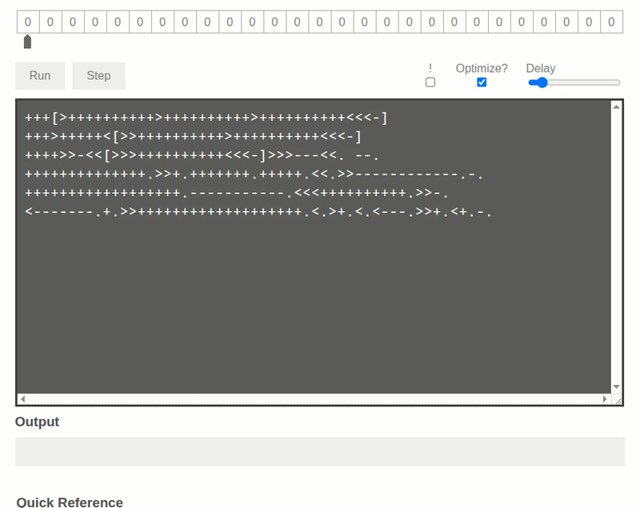

# Introdução à Linguagem

Brainfuck é uma _linguagem de programação esotérica_ criada por Urban Müller em 1993. Seu objetivo é ser minimalista, com apenas 8 comandos. Apesar de sua simplicidade, é [Turing completa](https://pt.wikipedia.org/wiki/Turing_completude) — ou seja, capaz de expressar qualquer algoritmo.

<p align="center">
   
</p>

# Sintaxe: Os 8 Comandos da Linguagem

Brainfuck opera sobre uma "fita" (array) de células (valores inteiros de 0 a 255), um ponteiro de posição e um conjunto mínimo de instruções:

| Comando | Significado                                                              |
| ------- | ------------------------------------------------------------------------ |
| `>`     | Move o ponteiro para a **direita**                                       |
| `<`     | Move o ponteiro para a **esquerda**                                      |
| `+`     | Incrementa o valor da **célula atual**                                   |
| `-`     | Decrementa o valor da **célula atual**                                   |
| `.`     | Imprime o **caractere ASCII** da célula atual                            |
| `,`     | Lê um caractere da entrada e armazena na célula atual                    |
| `[`     | Início de um **loop**: se o valor da célula atual for 0, pula até o `]`  |
| `]`     | Fim do loop: se o valor da célula atual for diferente de 0, volta ao `[` |

# Como o Interpretador Funciona (Explicação do Script em Python)

Aqui está o funcionamento passo a passo do script [bf.py](https://github.com/ahaerdy/python-scripts/blob/main/bf/bf.py):

## 1. Incicialização

```
tape = [0] * 1000
ptr = 0
i = 0
loop_stack = []

```

- Cria uma "fita" com 1000 células (como um array de memória).
- O ponteiro ptr começa na primeira célula.
- A variável i percorre o código Brainfuck.
- A loop_stack guarda as posições de colchetes [ para controle de loops aninhados.

## 2. Interpretação comando a comando

```
while i < len(code):
    command = code[i]
```

- A cada iteração, o script analisa um caractere do código Brainfuck.

## 3. Comandos principais

- \> e < → movem o ponteiro

```
if command == '>':
    ptr += 1
elif command == '<':
    ptr -= 1
```

- \+ e - → modificam a célula atual (incementando ou decrementando seu conteúdo numérico)

```
elif command == '+':
    tape[ptr] = (tape[ptr] + 1) % 256
elif command == '-':
    tape[ptr] = (tape[ptr] - 1) % 256
```

- O % 256 garante que os valores fiquem entre 0 e 255 (comportamento cíclico).

## 4. Saída e entrada

```
elif command == '.':
    print(chr(tape[ptr]), end='')
elif command == ',':
    user_input = input("Entrada: ")[0]
    tape[ptr] = ord(user_input)
```

- . imprime o valor da célula como caractere ASCII.
- , lê um caractere do usuário e armazena como número na célula.

## 5. Estrutura de controle (loops)
- \[ → início de loop

```
elif command == '[':
    if tape[ptr] == 0:
        # pula para depois do ']'
    else:
        loop_stack.append(i)
```

- \] → fim de loop

```
elif command == ']':
    if tape[ptr] != 0:
        i = loop_stack[-1]  # volta para o início do loop
    else:
        loop_stack.pop()
```

- Isso permite que o código repita trechos enquanto a célula atual for diferente de 0, como while.

# Exemplo: "Hello World!"

```
++++++++++[>+++++++>++++++++++>+++>+<<<<-]>++.>+.+++++++..+++.>++.<<+++++++++++++++.>.+++.------.--------.>+.>.
```

## Passo a passo:

- ++++++++++ → célula 0 = 10
- [>+++++++>++++++++++>+++>+<<<<-] → loop que prepara as células 1 a 4 com valores:
- célula 1 = 70 (H)
- célula 2 = 100 (e)
- etc.

## Depois disso, o código move entre essas células e usa . para imprimir:

```
H, e, l, l, o, , W, o, r, l, d, !
```

# Como usar o interpretador

1. Salve o código como bf.py
2. Execute no terminal:
```
python bf.py

```
3. Cole o código quando solicitado.

# Dica de Segurança

Brainfuck por si só é inofensivo. Mas, evite executar códigos desconhecidos em interpretadores automatizados, especialmente se forem de fontes não confiáveis. Eles podem esconder comportamentos perigosos (como [forkbombs](https://en.wikipedia.org/wiki/Fork_bomb)) — especialmente se usados com `eval`.

## Extras

- [Brainfuck Fork Bomb Generator](https://github.com/victornunesc/brainfuck-forkbomb)
